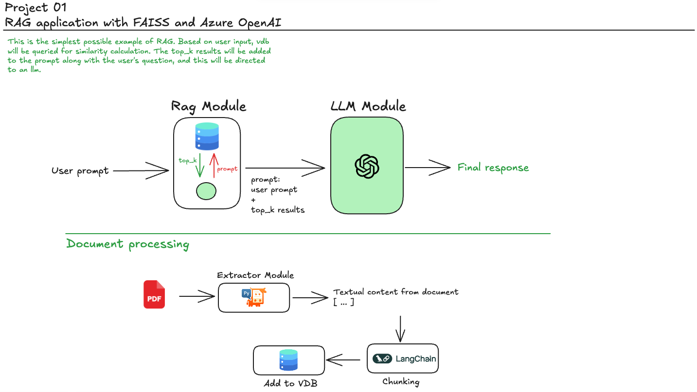

## RAG, GraphRAG and AgenticRAG Projects

This repository aims to present basic projects using the RAG and LLM concepts. The `notebooks` folder presents isolated tests of the services consumed by both projects. Feel free to use any project from this repository as you wish.

---

### Project 01 - RAG with AzureOpenAI and FAISS:
---

<div align="center">
  
</div>

The first project in this series explores basic concepts of RAG. It is a classic application of context enrichment through similarity search in a vector store to generate contextualized answers based on document information.

This project uses embedding models and LLMs via Azure OpenAI. However, you can easily adapt the `AzureOpenaiService` class, from `azure_openai.py`, to use any other models.
```python
└── 📁src
    └── 📁services
        ├── __init__.py
        ├── azure_openai.py
```

There is also the possibility of using llms via `Groq Cloud` through the `GroqCloudService` class of `groq_cloud.py`.

```python
└── 📁src
    └── 📁services
        ├── __init__.py
        ├── groq_cloud.py
```

This project aims to present a RAG application developed using FAISS. Basically, based on the user's prompt, a query is made in the previously defined vector database. Based on similarity, the result is texts that have some similarity to the user's prompt. The results are formatted and inserted as context for an LLM that will answer the user's question using the provided context.

To run the application, use the following command:
```python
streamlit run 01_faiss.py
```
